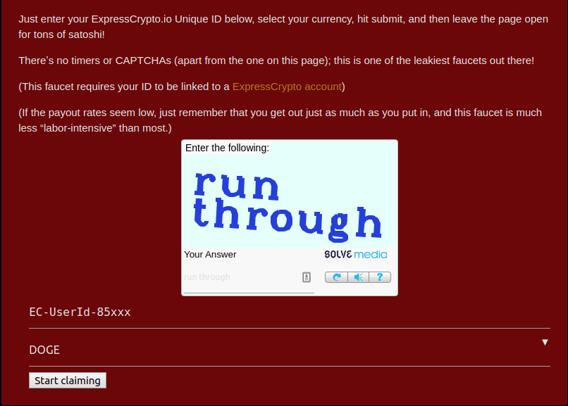
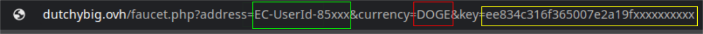

Selamat datang di blog **Geek IT**, sebuah blog yang dibuat demi anda ***geek people*** untuk mencoba hal-hal seputar dunia `coding`.

Jadi di postingan ini, saya akan membahas mengenai tools untuk nuyul **Expresscrypto** menggunakan ***auto claim faucet***.

Jadi konsep dari aplikasi ini yaitu kalian tinggal memasukkan ***Expresscrypto address***, ***currency*** yang ingin didapatkan, sama ***key auto claim faucet***-nya.

Langsung aja kita bahas langkah-langkahnya!

## Persiapan Akun

Langkah pertama yaitu membuat akun di [Expresscrypto](https://bit.ly/2yQIXMw).

Setelah kalian mendaftarkan diri di [Expresscrypto](https://bit.ly/2yQIXMw), kalian akan mendapatkan ***Unique ID*** yang dapat digunakan untuk *nuyul* di Web Auto Faucet.

Nah untuk Web Auto Faucet, saya menggunakan Web Auto Faucet dari [Dutchybig](https://bit.ly/2AoALmP).

Kemudian di [Dutchybig](https://bit.ly/2AoALmP), kalian masukkan captcha, [Expresscrypto](https://bit.ly/2yQIXMw) ID yang tadi sudah didapatkan, dan *currency* yang diinginkan.

<div className="Image__Small">

</div>

Selamat, anda berhasil mendapatkan ***tuyul*** yang bisa anda eksploitasi (LOL).

Simpan alamat url dari web auto faucet setelah di isi dengan [Expresscrypto](https://bit.ly/2yQIXMw) ID kalian ya, karena link tersebut akan digunakan pada langkah selanjutnya.

## Cara Memasang Tools Auto Claim Faucet - Expresscrypto Termux

Bahan-bahan yang perlu di siapkan: [Termux](https://play.google.com/store/apps/details?id=com.termux&hl=en)

* Install termux melalui link yang telah disediakan di atas
* Jalankan perintah dibawah baris per baris:

```bash
pkg install git bash -y
git clone https://github.com/coziboy/termux-mining.git
cd ~/termux-mining
bash setup.sh
```

* Tools telah berhasil di install!!!

## Cara Menggunakan tools

Berikut cara menggunakan tools tersebut:

* Ketikkan perintah berikut di Termux:

```bash
mine
```

* Ketika anda baru menggunakan tools pertama kalinya, maka akan muncul menu untuk membuat config. Lakukan pengisian sebagai berikut:

**`Expresscrypto Address:`** isi dengan Alamat [Expresscrypto](https://bit.ly/2yQIXMw) kalian. Contoh: EC-UserId-85xxx

**`Currency :`** isi dengan currency yang anda inginkan. Untuk list currency yang bisa digunakan silahkan lihat di website [Dutchybig](https://bit.ly/2AoALmP)

**`Key :`** isi dengan key yang anda dapatkan dari website [Dutchybig](https://bit.ly/2AoALmP)

Berikut penjelasannya disertai dengan gambar:

<div className="Image__Small">

</div>

Penjelasan:

Lalu anda diminta untuk mengisi nama config yang anda buat.

Yap, anda telah berhasil membuat config **Tools Auto Claim Faucet - Expresscrypto Termux**.

Untuk langkah selanjutnya yaitu anda tinggal memilih menu **1) Mining** atau **2) Buat Config Baru** dengan memasukkan angka pilihan menu (1 atau 2).

Apabila anda memilih angka 1, maka akan muncul daftar config yang telah anda buat, dan apabila anda memilih angka 2 maka anda akan melakukan proses pembuatan config lagi seperti yang telah dijelaskan di atas.

Sekian postingan saya mengenai **Tools Auto Claim Faucet - Expresscrypto Termux**, semoga bermanfaat!